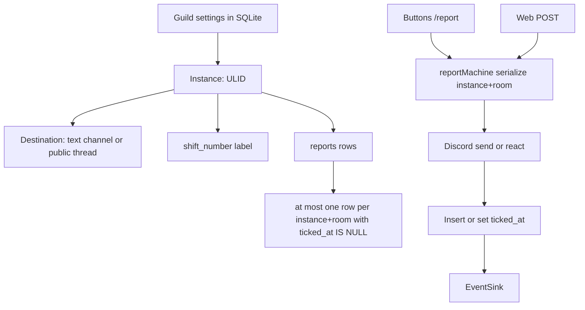

# Animal Hospital Organizer — Locked Spec + Architecture

> **For agentic workers:** REQUIRED SUB-SKILL: Use superpowers:subagent-driven-development (recommended) or superpowers:executing-plans to implement this plan task-by-task. Steps use checkbox (`- [ ]`) syntax for tracking.
>
> Implement in order: [`01-scaffold-db.md`](01-scaffold-db.md) → [`02-report-machine.md`](02-report-machine.md) → [`03-discord.md`](03-discord.md) → [`04-web.md`](04-web.md) → [`05-lifecycle.md`](05-lifecycle.md).
> Do not start coding until the user switches to Code mode.

**Goal:** A multi-guild Discord bot plus a Discord-OAuth web pad that logs Animal Hospital room observations (`RM1`–`RM8` `ANOMALY`/`MAYBE`) into a shift instance, with room-level occupancy, ticks for clear, and a live structured log.

**Architecture:** One Node.js process runs discord.js and Express against one SQLite file. An *instance* is the state owner (guild + destination + shift). Discord buttons, `/report`, and the web pad all call the same serialized post-or-tick machine. Discord-only mode lives in a `ModeStore` (in-memory). SSE lives behind an `EventSink` (in-process `EventEmitter` now).

**Tech Stack:** Node 20+, TypeScript, discord.js v14, Express, better-sqlite3, ULID, signed httpOnly cookies. No React. No Redis. No Docker in MVP. No message-content intent.

## Global Constraints

- Node `>=20`. TypeScript strict. ESM (`"type": "module"`).
- Single process in MVP. Do **not** run multiple Discord gateways.
- Interfaces `ModeStore` and `EventSink` exist from day one even if only in-memory implementations ship.
- Report writes go through **one** module. Discord send/react happens **before** SQLite commit.
- Rooms are exactly `RM1`…`RM8` (no zero pad, not configurable).
- Banner: `---- SHIFT {n} ----` (spaces around `SHIFT` and `n`).
- Report body: line 1 `RM{n} ANOMALY` or `RM{n} MAYBE`, LF, line 2 display name, **no mention**.
- Thread default name: `HH:mm-DDMMYYYY` (colon, 24h, guild IANA TZ, zero-padded).
- Mode ephemeral: `Mode: ANOMALY` / `Mode: MAYBE`.
- Tick on Discord: configured guild emoji else Unicode `✅`. Web log **always** Unicode `✅`.
- Pink `#ff4d6d`, yellow `#ffd166`.
- Hardcoded open-instance cap: 20 per guild. Create throttle: 3 per user per minute (Discord and web).
- Shift integer `1`–`99999`. Admin override: `counter = max(counter, n)`. Duplicate open shift labels allowed. Instance id is ULID.
- No Roblox integration. No message parser. No edit/delete of reports. No DMs. No stats. No instance list UI.
- No message-content privileged intent.
- Bot bind `0.0.0.0`, `PORT` default `3000`.

---

## 1. Who owns state



- **Guild** owns: default output channel, timezone, Shift Lead role, tick emoji, idle hours, tombstone hours, shift counter.
- **Instance** owns: destination, shift label, banner/panel message ids, created_by, last_activity_at, closed_at, the report log.
- **Room occupancy** is instance-wide, not per user.
- **Discord Mode** is per `(userId, instanceId)` in process memory. Lost on restart → `ANOMALY`. Web Mode is browser-local and never touches `ModeStore`.

## 2. Instance lifecycle

**User-invoke** (`/session start` or Web Start):

1. Guild must have `/setup` (default channel set).
2. Caller must be a guild member with View Channel **and** Send Messages on the default output channel (web: View Channel only, matching Q47/Q60 split: Discord start requires View+Send; web start/report requires View).
3. Bot checks its own perms on that channel.
4. Cap 20 open instances / guild; throttle 3 creates / user / minute.
5. `shift_number = counter + 1`, then `counter = shift_number`.
6. Create public thread under default channel, name `HH:mm-DDMMYYYY` in guild TZ, auto-archive 24h.
7. Post banner, then panel. Do **not** pin.
8. Persist instance. Reply ephemeral with URL. Panel embed also has the URL.

**Admin-invoke** (`/session start-admin`, Shift Lead or Manage Server / Administrator):

- Pick guild **text** channel (not voice, forum, category, not an existing thread as parent).
- `thread` yes/no. If yes: optional name (trim, max 100, reject empty-if-provided; default timestamp).
- Optional shift number; omitted → next counter. If provided: use it and `counter = max(counter, n)`.
- `thread=no` **rejected** if an **open unthreaded** instance already has `destination_channel_id` equal to that channel. Open **threads under** that parent do **not** block. `thread=yes` always allowed.

**URL** `/g/{guildId}/i/{instanceId}` never creates. Unknown id → 404. Closed → page with buttons disabled until `closed_at + tombstone_hours`, then 404. Writes while closed → 409.

**Close** (`/session close` or idle job):

- Who: Shift Lead or Manage Server / Administrator. Not the invoker-only, not any reporter. If Shift Lead role unset, only Manage Server / Administrator.
- Target: autocomplete open instances (`SHIFT n`, thread name, id). If command is run inside an instance destination channel, that instance is default.
- Effect: `closed_at = now`, disable web writes, edit panel embed to Closed **and remove action rows**, archive thread if any (best-effort). SQLite rows stay. No purge job.
- Web has **no** Close button.

**Idle:** `/setup idle_hours` default 6, range 1–72. `last_activity_at = max(created_at, last post or tick)`. Unused instance closes 6h after invoke. Ticks refresh idle. Human chat does not. `setInterval` 60s. Discord thread archive ≠ close; while open, unarchive on each structured report (unarchive failure non-fatal if send succeeds). Create threads with 24h auto-archive.

**Bot removed from guild:** close all open instances in SQLite; skip Discord edits if impossible. Re-invite + `/setup` does not reopen old URLs.

## 3. Report state machine (locked)

Serialize on `instance_id + room` (Promise chain + SQLite transaction).

```
if instance closed → 409
if no uncleared row for (instance, room) → POST
else → TICK that row
```

Invariant: **at most one** uncleared report per `(instance_id, room)`. Partial unique index `WHERE ticked_at IS NULL`. A second uncleared insert is a bug.

- POST: send Discord message first; only then insert reports row. Display name = guild nickname else Discord display name; web fetches member, else OAuth global name.
- TICK: add guild tick emoji (else `✅`) to that message; set `ticked_at`. Kind of the clicker is **ignored**. `/report kind:` is ignored when occupied. **No amend.**
- After tick, next press POSTs a new cycle under the presser’s name and current mode. Ticked messages stay.
- If the target message is **deleted** or unknown: treat as no uncleared, POST instead, and set `ticked_at` on the orphan row if it still exists (so the unique index allows the new post).
- If react fails for perms/outage: **502**, no SQLite tick, user retries.
- Occupancy (web pad, SSE): uncleared ANOMALY → pink; else uncleared MAYBE → yellow; else default. Mixed is impossible under the invariant.
- **Crosstalk is intended:** Bob clicking occupied RM3 ticks Alice’s message.

Anyone who can use the destination may report (Discord). Web: OAuth user must be a guild member **and** have View Channel on the instance’s **parent** text channel.

Human freeform in the thread is ignored. No parser.

## 4. Discord surfaces

Commands (global slash):

- `/setup` — Manage Server or Administrator. Upsert guild settings. Changing default channel does **not** move open instances.
  - `channel` required guild text
  - `timezone` string, autocomplete common IANA, reject unknown (`Intl.supportedValuesOf('timeZone')`)
  - `shift_lead` optional Role
  - `tick_emoji` optional unicode or `<:name:id>` / `<a:name:id>`; empty = `✅`. If `react()` rejects, react `✅` and persist fallback `✅` for that guild until next `/setup` (do not loop)
  - `idle_hours` 1–72 default 6
  - `tombstone_hours` 1–72 default 2
- `/session start` — any member with View+Send on default channel
- `/session start-admin` — Shift Lead or Manage Server
- `/session close` — Shift Lead or Manage Server
- `/report room:` choices RM1–RM8, optional `kind: ANOMALY|MAYBE` **this press only** (does not flip ModeStore). Uses ModeStore if `kind` omitted. **Only** if `interaction.channel_id` equals an open instance `destination_channel_id`. Else ephemeral `Run this in the session thread or use the panel`. Never inherit parent.

Panel (one message, unpinned):

- Row 1: `Mode` (Secondary)
- Row 2: `RM1`–`RM5`
- Row 3: `RM6`–`RM8`
- Embed title `SHIFT {n}`, description = public URL, footer `started by {DisplayName}`
- Mode button: flip that user’s `ModeStore`, ephemeral `Mode: …`. Shared message cannot show per-user color.
- Room button: post or tick; ephemeral `Posted RM3 ANOMALY` / `Posted RM3 MAYBE` / `Cleared RM3`
- `custom_id` includes instance ULID
- On close: edit embed Closed, **remove** action rows

Commands may be run from anywhere in the guild; destination is **not** the current channel unless admin chose it.

## 5. Web surfaces

- OAuth scopes `identify` + `guilds`. Bot token fetches member + channel perms.
- Cookie: signed httpOnly SameSite=Lax, 7-day max-age, Discord user id. No refresh token. Logout not in MVP.
- CSRF token in HTML, required on POST. Also require `Origin`/`Referer` host match `PUBLIC_BASE_URL`.
- `/` after login: buttons for mutual guilds where bot is in **and** `/setup` done. Empty: copy `Invite the bot and run /setup` + invite URL (bot + `applications.commands` + permission integer). POST create = user-invoke, 302 to `/g/{guildId}/i/{ulid}`. No instance list. Web never admin-invokes.
- Instance page: one route. Top: shift #, Mode toggle `Mode: ANOMALY`, RM1–RM8 occupancy colors, closed/error. Below: live log newest at bottom.
- Portrait: Mode full width, rooms 2×4. Landscape: Mode full width, rooms 4×2 or wrap. Fat tap targets.
- Mode is local JS; refresh → ANOMALY. Does not recolor rooms.
- SSE snapshot then deltas; fallback poll 2s. Structured log only (banner from instance row + reports). No Discord scrape.
- Log: SHIFT banner distinct (no room color), text `---- SHIFT {n} ----`, time `HH:mm:ss` guild TZ from `created_at`. Report rows tint pink/yellow; on tick keep row, mute + strikethrough + `✅`, keep created time, no `ticked_at` display.
- Web POST 200 + SSE; no success toast. Errors 4xx/5xx short reason.

Invite permission integer must include: View Channel, Send Messages, Send Messages in Threads, Embed Links, Read Message History, Add Reactions, Create Public Threads, Manage Threads, Use External Emojis.

## 6. Env

```
DISCORD_TOKEN
DISCORD_CLIENT_ID
DISCORD_CLIENT_SECRET
PUBLIC_BASE_URL
SESSION_SECRET
SQLITE_PATH
PORT                 # default 3000
TRUST_PROXY          # optional "1"
```

## 7. Target file map

```
package.json
tsconfig.json
.env.example
src/index.ts
src/config.ts
src/db.ts
src/clock.ts
src/domain/rooms.ts
src/domain/strings.ts
src/domain/timezone.ts
src/domain/shift.ts
src/domain/reportMachine.ts
src/stores/ModeStore.ts
src/stores/MemoryModeStore.ts
src/stores/EventSink.ts
src/stores/InProcessEventSink.ts
src/stores/locks.ts
src/stores/guildSettings.ts
src/stores/instances.ts
src/stores/reports.ts
src/discord/permissions.ts
src/discord/panel.ts
src/discord/destination.ts
src/discord/postOrTick.ts
src/discord/registerCommands.ts
src/discord/handlers/setup.ts
src/discord/handlers/session.ts
src/discord/handlers/report.ts
src/discord/handlers/buttons.ts
src/discord/handlers/guildDelete.ts
src/web/app.ts
src/web/oauth.ts
src/web/csrf.ts
src/web/cookies.ts
src/web/permissions.ts
src/web/routes/start.ts
src/web/routes/instance.ts
src/web/views/layout.ts
src/web/views/start.ts
src/web/views/instance.ts
src/public/app.css
src/public/app.js
src/jobs/idleCloser.ts
tests/rooms.test.ts
tests/strings.test.ts
tests/timezone.test.ts
tests/reportMachine.test.ts
tests/shift.test.ts
tests/locks.test.ts
tests/guildSettings.test.ts
tests/instances.test.ts
tests/csrf.test.ts
README.md
```

## 8. Out of scope (do not implement)

Roblox, multi-process cluster, Redis, Docker, React, per-user last-report pointer, personal/private threads, pinning, parsing human text, `/rm1`…`/rm8`, `/mode`, web Close, web admin-invoke, instance list, logout, message-content intent, report edit/delete, custom room names, forum channels.

---

Next: [`01-scaffold-db.md`](01-scaffold-db.md)
