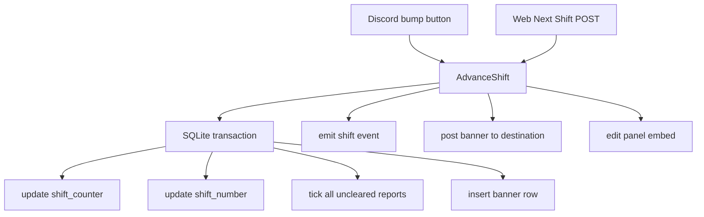

# Next Shift Parity — Design

## Problem

The current "Next Shift" behavior is Discord-only and incomplete:

- **Discord**: The panel has a `bump` button (`src/discord/handlers/report.ts:38-55`) that increments `shift_counter`, updates `instances.shift_number`, and edits the panel embed. It does **not** insert a banner row into the report log, does **not** tick/reset uncleared rooms, and does **not** emit an SSE event for the web UI.
- **Web**: There is **no** Next Shift button. The shift number is only displayed in the `<h1>` and initial banner row; it never updates after page load.

The shift number should be an in-game counter that increments when players finish curing patients / dealing with leftover anomalies. Both Discord and web need a **Next Shift** button with identical behavior.

## Requirements (locked)

1. **Next Shift button on both web and Discord.**
2. **Any participant who can report** may advance the shift (same permission as room buttons).
3. **Insert a new banner line** in the log at each shift transition (`---- SHIFT {n} ----`).
4. **Reset all rooms to clear** when the shift advances (tick all uncleared reports).
5. **Update the panel embed** on Discord and the `<h1>` + log on web in real time.

## Architecture

One shared domain function `advanceShift` in `src/domain/shift.ts` (or a new `src/domain/shiftMachine.ts`) owns all state changes. Discord and web call it. Discord additionally updates the panel embed imperatively after the call.



## Domain: `advanceShift`

**File:** `src/domain/shift.ts` (extend) or `src/domain/shiftMachine.ts` (new).

**Signature:**
```ts
export async function advanceShift(opts: {
  db: Database.Database;
  instance: Instance;
  userId: string;
  displayName: string;
  clock: Clock;
  events: EventSink;
  discord: DiscordPort;
  newId: () => string;
}): Promise<{ shiftNumber: number; bannerReport: Report }>
```

**Steps:**
1. If `instance.closedAt`, throw `ClosedInstanceError`.
2. Read `settings.shiftCounter`, compute `nextCounter(settings.shiftCounter)`.
3. In a SQLite transaction:
   - `setShiftCounter(db, guildId, counter.counter)`.
   - `updateInstanceShiftNumber(db, instance.id, counter.shiftNumber)`.
   - `UPDATE reports SET ticked_at = now WHERE instance_id = ? AND ticked_at IS NULL AND type = 'report'`.
   - Insert banner row into `reports` with `type = 'banner'`, `room = NULL`, `kind = NULL`, `display_name = ''`, `discord_message_id = ''`, `created_at = now`, `ticked_at = NULL`.
4. Emit SSE event `{ type: "shift", instanceId, shiftNumber, report: bannerRow }`.
5. Extend `DiscordPort` with `sendBanner(input: { instance: Instance; shiftNumber: number }): Promise<{ messageId: string }>`.
6. Return `{ shiftNumber, bannerReport }`.

**Error handling:**
- If `discord.sendBanner` fails, the DB transaction has already committed. The banner row exists in the log, but Discord is missing the banner message. This is acceptable: the web log is the source of truth, and Discord can be manually recovered. Alternatively, we could do Discord first then DB (like `applyReport`), but that complicates the transaction. We choose **DB first** because the banner is a log entry, not a Discord-side action.

## Database & Store changes

**Schema migration** (`src/db.ts`):
- `ALTER TABLE reports ADD COLUMN type TEXT NOT NULL DEFAULT 'report'`.
- Update partial unique index: `CREATE UNIQUE INDEX IF NOT EXISTS idx_reports_one_uncleared ON reports(instance_id, room) WHERE ticked_at IS NULL AND type = 'report'`.
  - *Note:* SQLite allows multiple NULLs in unique indexes, so banner rows (`room = NULL`) would not conflict even without the `type = 'report'` predicate. Adding the predicate is defensive and self-documenting.

**Store changes** (`src/stores/reports.ts`):
- `Report` type gains `type: "report" | "banner"`.
- `insertReport` accepts `type` and allows `room`/`kind`/`discordMessageId` to be empty strings for banner rows.
- `getUncleared` filters `type = 'report'`.
- `occupancy` filters `type = 'report'`.
- `listReports` returns all rows (including banners) in chronological order.
- `tickReport` filters `type = 'report'` (defensive).

## Discord surface

**Panel** (`src/discord/panel.ts`):
- The **Next Shift** button already exists in Row 1 (`id("bump")`). No change needed.

**Button handler** (`src/discord/handlers/report.ts`):
- Replace the inline bump logic (lines 38-55) with a call to `advanceShift`.
- After `advanceShift` returns:
  - Edit the panel embed: `buildPanelEmbed({ shiftNumber: result.shiftNumber, url, startedBy: instance.createdByDisplayName })`.
  - Reply ephemerally: `Shift advanced to SHIFT {n}.`
- On error, reply ephemerally with the error message (same pattern as room buttons).

## Web surface

**View** (`src/web/views/instance.ts`):
- Add a **Next Shift** button next to the Mode toggle: `<button id="next-shift" type="button">Next Shift</button>`.
- Disabled when `opts.closed` is true.

**Route** (`src/web/app.ts`):
- New endpoint: `POST /g/:guildId/i/:instanceId/shift`.
- Auth: same `getAuthorized` as report endpoint.
- CSRF: same check.
- Calls `advanceShift` with `displayName` fetched via `memberDisplayName`.
- Returns `{ ok: true, shiftNumber }` on success; `409` if closed; `400`/`502` on other errors.

**Client** (`src/public/app.js`):
- Add click handler for `#next-shift`.
- On click, POST to `${location.pathname}/shift` with CSRF token.
- On success, rely on the SSE `shift` event to update the UI (or apply the response directly if SSE is not yet connected).
- Handle `shift` event:
  - Update `document.querySelector("h1").textContent = \`SHIFT ${shiftNumber}\``.
  - Append the banner row to `#log` (rendered same as initial banner rows).
  - Clear all occupancy classes from room buttons (`button.classList.remove("occ-ANOMALY", "occ-MAYBE")`).

## SSE

**Event type** (`src/stores/EventSink.ts`):
```ts
export type LogEvent =
  | { type: "snapshot"; instanceId: string }
  | { type: "report"; instanceId: string; report: Report }
  | { type: "tick"; instanceId: string; report: Report }
  | { type: "shift"; instanceId: string; shiftNumber: number; report: Report }
  | { type: "closed"; instanceId: string; closedAt: string };
```

## Testing

- `tests/shift.test.ts`: add tests for `advanceShift` covering:
  - Incrementing shift number and updating counter.
  - Ticking all uncleared reports.
  - Inserting a banner row.
  - Emitting the `shift` event.
  - Throwing `ClosedInstanceError` on closed instance.
- `tests/reportMachine.test.ts`: ensure existing report/tick logic is unaffected by the `type` column.
- `tests/instances.test.ts`: verify `updateInstanceShiftNumber` still works.
- `tests/reportsRepo.test.ts`: verify `listReports` includes banners, `getUncleared`/`occupancy` ignore banners, and the unique index allows multiple banner rows.

## Out of scope

- No `/session next-shift` slash command (button-only on both surfaces).
- No shift history view.
- No undo.
